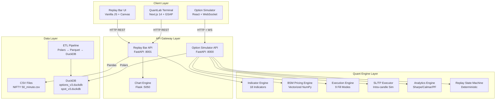
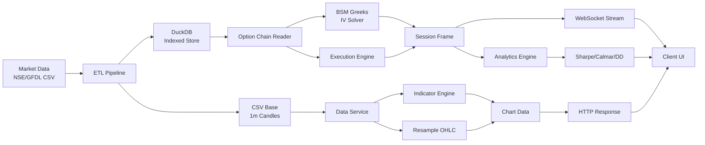
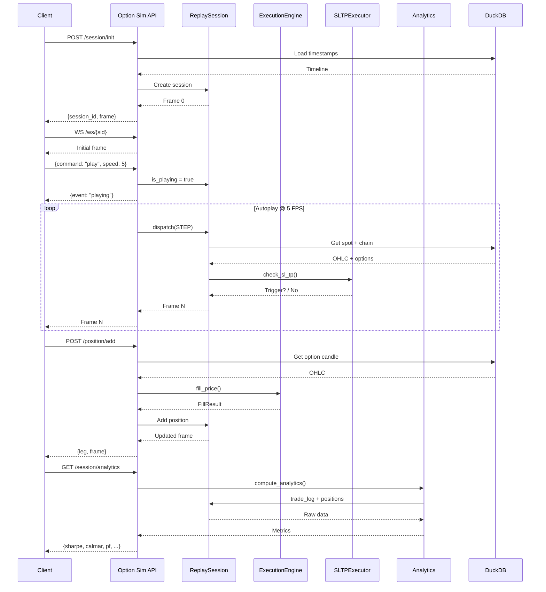
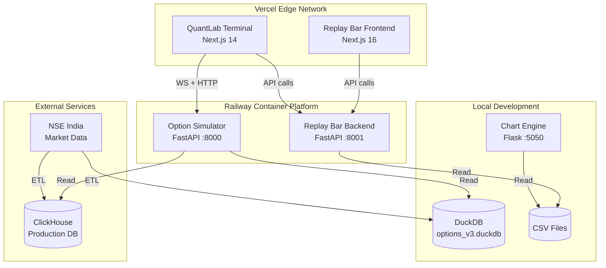
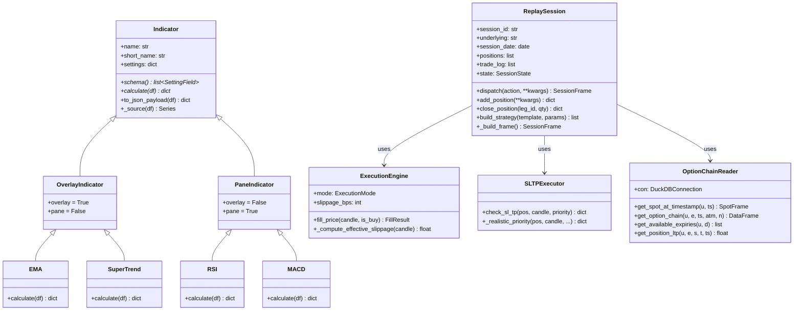

# SIHL Quant Trading Platform — Complete Architecture Document

**Document Version:** 1.0  
**Date:** June 6, 2026  
**Classification:** Internal Engineering Documentation  
**Authors:** Principal Software Architect  

---

## Table of Contents

1. [Executive Summary](#1-executive-summary)
2. [High-Level Architecture](#2-high-level-architecture)
3. [Technology Stack](#3-technology-stack)
4. [Detailed Component Architecture](#4-detailed-component-architecture)
5. [End-to-End Data Flow](#5-end-to-end-data-flow)
6. [Sequence Diagrams](#6-sequence-diagrams)
7. [Mermaid Diagrams](#7-mermaid-diagrams)
8. [Deployment Architecture](#8-deployment-architecture)
9. [Dependency Mapping](#9-dependency-mapping)
10. [Technical Audit](#10-technical-audit)
11. [Engineering Summary](#11-engineering-summary)

---

## 1. Executive Summary

The SIHL Quant Trading Platform is a multi-module institutional-grade trading analytics and backtesting ecosystem designed for Indian NSE markets (NIFTY, BANKNIFTY, FINNIFTY). The platform comprises three core subsystems:

| Subsystem | Purpose | Target User |
|-----------|---------|-------------|
| **Replay Bar** | TradingView-style chart replay with 18+ technical indicators | Technical analysts |
| **Option Simulator** | Institutional options backtesting with BSM Greeks, IV analysis, SL/TP simulation | Options traders, quants |
| **QuantLab Terminal** | Premium analytics dashboard with backtest reports, Monte Carlo, risk metrics | Portfolio managers |

### Key Capabilities
- **Sub-10ms historical replay** with exact OHLC timestamps
- **Deterministic backtesting** — same inputs always produce identical outputs
- **Zero-lookahead guarantee** — strict `df.iloc[:idx+1]` slicing prevents future leakage
- **Vectorized BSM Greeks** — full 30-strike chain in <5ms
- **Real-time WebSocket autoplay** — 1-20 FPS with deterministic timing
- **Multi-timeframe support** — 1m through Weekly from single 1-minute base

---

## 2. High-Level Architecture

```
┌─────────────────────────────────────────────────────────────────────────────────────────┐
│                                    CLIENT LAYER                                          │
│  ┌────────────────────┐  ┌────────────────────┐  ┌────────────────────────────────────┐ │
│  │  Replay Bar UI     │  │  QuantLab Terminal │  │  Option Simulator Pro              │ │
│  │  (Vanilla JS +     │  │  (Next.js 14 +     │  │  (React + WebSocket)               │ │
│  │   Canvas charts)   │  │   GSAP + D3)       │  │                                    │ │
│  └─────────┬──────────┘  └─────────┬──────────┘  └─────────────────┬──────────────────┘ │
│            │                       │                               │                    │
│            │ HTTP REST             │ HTTP REST                     │ HTTP + WS          │
│            ▼                       ▼                               ▼                    │
└─────────────────────────────────────────────────────────────────────────────────────────┘
                                          │
┌─────────────────────────────────────────────────────────────────────────────────────────┐
│                                    API GATEWAY LAYER                                     │
│  ┌─────────────────────────────┐  ┌─────────────────────────────┐  ┌─────────────────┐ │
│  │  Replay Bar Backend         │  │  Option Simulator Backend   │  │  Chart Engine   │ │
│  │  (FastAPI / Port 8001)      │  │  (FastAPI / Port 8000)      │  │  (Flask / 5050) │ │
│  │                             │  │                             │  │                 │ │
│  │  • /api/candles             │  │  • /api/v1/session/*        │  │  • /api/candles │ │
│  │  • /api/indicators/*        │  │  • /api/v1/chain            │  │  • /api/indicators│ │
│  │  • /api/imbalances          │  │  • /ws/{session_id}         │  │  • /api/imbalances│ │
│  │  • /api/replay/status       │  │  • /api/v1/candles          │  │                 │ │
│  └─────────────┬───────────────┘  └─────────────┬───────────────┘  └─────────────────┘ │
│                │                                │                                        │
│                │ Pandas DataFrame               │ Polars DataFrame                       │
│                ▼                                ▼                                        │
│  ┌─────────────────────────────┐  ┌─────────────────────────────┐                        │
│  │  CSV Data Loader            │  │  DuckDB Data Reader         │                        │
│  │  (NIFTY 50_minute.csv)      │  │  (options_v3.duckdb)        │                        │
│  │  • 1m base → all TFs        │  │  • historical_options       │                        │
│  │  • Lazy TF cache            │  │  • historical_spot          │                        │
│  │  • Market hours filter      │  │  • INDIAVIX                 │                        │
│  └─────────────────────────────┘  └─────────────────────────────┘                        │
└─────────────────────────────────────────────────────────────────────────────────────────┘
                                          │
┌─────────────────────────────────────────────────────────────────────────────────────────┐
│                                    QUANT ENGINE LAYER                                    │
│  ┌─────────────────────────────┐  ┌─────────────────────────────┐  ┌─────────────────┐ │
│  │  Indicator Engine           │  │  BSM Pricing Engine         │  │  Execution      │ │
│  │  (18 indicators)            │  │  (Vectorized NumPy)         │  │  Engine         │ │
│  │                             │  │                             │  │                 │ │
│  │  • EMA/SMA/WMA/HMA/VWAP     │  │  • Black-Scholes-Merton     │  │  • 9 fill modes │ │
│  │  • SuperTrend (fixed)       │  │  • Greeks (Delta/Gamma/     │  │  • Slippage     │ │
│  │  • Bollinger/Keltner        │  │    Theta/Vega/Rho)          │  │    models       │ │
│  │  • RSI/MACD/CCI/Stoch       │  │  • IV Solver (Newton+       │  │  • SL/TP sim    │ │
│  │  • ATR/OBV/FVG/OB           │  │    Bisection)               │  │  • MTM engine   │ │
│  └─────────────────────────────┘  └─────────────────────────────┘  └─────────────────┘ │
│  ┌─────────────────────────────┐  ┌─────────────────────────────┐                        │
│  │  Analytics Engine           │  │  Replay State Machine       │                        │
│  │                             │  │                             │                        │
│  │  • Sharpe/Calmar/PF         │  │  • IDLE→INIT→PLAY→PAUSE    │                        │
│  │  • Max Drawdown             │  │  • Deterministic timeline   │                        │
│  │  • Win Rate/Expectancy      │  │  • No wall-clock deps       │                        │
│  │  • Trade Quality Score      │  │  • Position carry-forward   │                        │
│  └─────────────────────────────┘  └─────────────────────────────┘                        │
└─────────────────────────────────────────────────────────────────────────────────────────┘
                                          │
┌─────────────────────────────────────────────────────────────────────────────────────────┐
│                                    DATA LAYER                                            │
│  ┌─────────────────────────────┐  ┌─────────────────────────────┐  ┌─────────────────┐ │
│  │  CSV Files                  │  │  DuckDB Databases           │  │  ETL Pipeline   │ │
│  │  (Data/NIFTY 50_minute.csv) │  │  • options_v3.duckdb        │  │                 │ │
│  │                             │  │  • spot_v3.duckdb           │  │  • Polars parse │ │
│  │                             │  │                             │  │  • Parquet int. │ │
│  │                             │  │                             │  │  • Bulk load    │ │
│  └─────────────────────────────┘  └─────────────────────────────┘  └─────────────────┘ │
└─────────────────────────────────────────────────────────────────────────────────────────┘
```

---

## 3. Technology Stack

### Backend Services

| Component | Technology | Version | Purpose |
|-----------|-----------|---------|---------|
| Replay Bar API | FastAPI | 0.111.0 | HTTP REST for candles, indicators, imbalances |
| Option Simulator API | FastAPI | 0.111.0 | HTTP + WebSocket for session management |
| Chart Engine | Flask | — | Legacy Flask API (local dev) |
| Data Processing | Pandas | 2.2.2 | Time-series manipulation (Replay Bar) |
| Data Processing | Polars | 0.20.26 | High-performance DataFrames (Option Sim) |
| Database | DuckDB | — | Embedded analytical DB for options data |
| Math/Stats | NumPy | 1.26.4 | Vectorized computations |
| Math/Stats | SciPy | 1.13.0 | Special functions (ndtr for BSM) |
| WebSocket | Uvicorn | 0.29.0 | ASGI server with WebSocket support |
| Testing | Pytest | 8.2.0 | Unit tests |

### Frontend Applications

| Component | Technology | Version | Purpose |
|-----------|-----------|---------|---------|
| Replay Bar UI | Vanilla JS + Canvas | — | TradingView-style chart renderer |
| QuantLab Terminal | Next.js | 14.2.35 | Premium analytics dashboard |
| Option Simulator Pro | React + Vite | 18 | Options trading interface |
| ApeChain Landing | Next.js | 14.2.35 | Marketing/landing page |
| Styling | Tailwind CSS | 3.x | Utility-first CSS |
| Animation | GSAP | — | Complex timeline animations |
| Animation | Framer Motion | — | React component animations |
| Charts | D3.js | — | Custom SVG chart rendering |
| State | Zustand | — | Lightweight state management |

### Infrastructure

| Component | Technology | Purpose |
|-----------|-----------|---------|
| Cloud Platform | Vercel | Frontend hosting + CDN |
| Cloud Platform | Railway | Backend container hosting |
| Container | Docker | Backend deployment |
| Database | DuckDB | Local analytical database |
| Database (prod target) | ClickHouse | Production columnar store |

---

## 4. Detailed Component Architecture

### 4.1 Replay Bar Backend (`Replay bar/backend/`)

#### Purpose
Serves OHLCV candles, 18 technical indicators, and Fair Value Gap (FVG) imbalance zones for a TradingView-style charting platform. Enforces zero-lookahead replay via strict index slicing.

#### Key Files
| File | Role | Lines |
|------|------|-------|
| `app.py` | FastAPI app factory, CORS, router registration | 36 |
| `routes/candles.py` | GET `/api/candles` — timeframe, date range, replay slicing | 48 |
| `routes/indicators.py` | GET `/api/indicators/list`, POST `/api/indicators/calculate` | 69 |
| `routes/imbalances.py` | GET `/api/imbalances` — FVG zone detection | 70 |
| `routes/replay.py` | GET `/api/replay/status` — thin status endpoint | 7 |
| `services/data_service.py` | Singleton DataService — loads 1m CSV, lazy TF cache | 34 |
| `data/loader.py` | CSV → DataFrame, resample_ohlc, df_to_json_list | 166 |
| `indicators/base.py` | Abstract Indicator, OverlayIndicator, PaneIndicator, SettingField | 121 |
| `indicators/__init__.py` | INDICATOR_REGISTRY — 18 indicator classes | — |

#### API Endpoints
```
GET  /                  → {"status": "ok", "message": "NIFTY Chart Engine API is running."}
GET  /api/candles       → OHLCV candles (tf, start, end, replay_idx, offset, limit)
GET  /api/indicators/list → All indicators + editable schema
POST /api/indicators/calculate → Compute indicator on demand
GET  /api/imbalances    → Bullish/bearish FVG zones with gap % filtering
GET  /api/replay/status → {"status": "Replay engine is managed client-side via zero-lookahead slicing."}
```

#### Inputs
- `NIFTY 50_minute.csv` — 1-minute OHLCV data with columns: date, open, high, low, close, volume
- HTTP query parameters: tf, start, end, replay_idx, offset, limit, min_size

#### Outputs
- JSON candles array with datetime, open, high, low, close, volume
- JSON indicator payload with metadata + calculated series
- JSON imbalance zones with top/bottom prices, creation time, active status

#### Internal Workflow
```
1. DataService singleton loads CSV on first import
   → load_minute_data() parses CSV with optimized dtypes
   → Filters to market hours (09:15–15:30 IST)
   → Stores df_1m in memory

2. On /api/candles request:
   → get_timeframe(tf) checks tf_cache
   → If miss: resample_ohlc(df_1m, tf) using pandas resample
   → Apply date range filter via datetime_str comparison
   → Apply replay_idx slice: df.iloc[:replay_idx+1] (zero-lookahead)
   → Apply offset/limit windowing
   → Convert to JSON via df_to_json_list()

3. On /api/indicators/calculate request:
   → Lookup indicator class from INDICATOR_REGISTRY
   → Instantiate with user settings
   → Get timeframe DataFrame (same caching)
   → Apply same filters (date, replay_idx)
   → Call inst.calculate(df) → inst.to_json_payload(df)
   → Return structured JSON

4. On /api/imbalances request:
   → Get timeframe DataFrame
   → Iterate candles to detect FVG gaps
   → Bullish: prev.high < next.low
   → Bearish: prev.low > next.high
   → Filter by min_size % threshold
   → Return zones with metadata
```

#### Dependencies
- fastapi, uvicorn, pandas, numpy, pydantic
- External: CSV file at `Data/NIFTY 50_minute.csv`

---

### 4.2 Option Simulator Backend (`Replay bar/option_simulator/backend/`)

#### Purpose
Institutional-grade options backtesting simulator with sub-10ms historical replay, exact OHLC timestamps, Black-Scholes Greeks engine, and WebSocket autoplay streaming.

#### Key Files

**Core Application**
| File | Role | Lines |
|------|------|-------|
| `app/main.py` | FastAPI app — HTTP + WebSocket endpoints, session management | 850+ |
| `app/engine/replay.py` | ReplaySession state machine, SessionFrame builder | 850 |
| `app/quant/greeks.py` | Vectorized BSM pricing, Greeks, IV solver | 484 |
| `app/quant/execution.py` | ExecutionEngine, SLTPExecutor, MTMEngine | 505 |
| `app/quant/analytics.py` | Portfolio analytics: Sharpe, Calmar, PF, Max DD | 319 |
| `app/data/reader.py` | OptionChainReader — DuckDB queries | 380 |
| `app/data/constants.py` | LOT_SIZES, STRIKE_INTERVALS | 19 |

**ETL Pipeline**
| File | Role |
|------|------|
| `scripts/etl_pipeline.py` | ClickHouse ETL (production target) |
| `scripts/etl_local.py` | DuckDB ETL v2 (local dev) |
| `scripts/etl_v3.py` | DuckDB ETL v3 — Parquet intermediate → DuckDB (fastest) |
| `scripts/etl_prod.py` | Production DuckDB ETL with unified view |
| `scripts/import_spot.py` | Separate spot DB import |

#### API Endpoints

**HTTP Endpoints**
```
POST /api/v1/session/init           → Create replay session
POST /api/v1/session/action         → Dispatch replay action (JUMP, SEEK, PLAY, PAUSE, SOD, EOD)
POST /api/v1/session/next_day       → Move to next/prev trading day with position carry
POST /api/v1/session/position/add   → Open option leg (strike, type, direction, qty)
POST /api/v1/session/position/close → Close/partial-close leg by leg_id
POST /api/v1/session/position/sltp  → Update SL/TP prices and modes
POST /api/v1/session/strategy/build → Build multi-leg strategy from template
GET  /api/v1/session/analytics      → Advanced analytics for current session
GET  /api/v1/chain                  → Enriched option chain at timestamp (OHLC + IV + Greeks)
POST /api/v1/chain/delta-strike     → Find strike closest to target delta
GET  /api/v1/candles                → Spot OHLC candles for charting
GET  /health                        → Health check + active session count
```

**WebSocket Endpoint**
```
WS /ws/{session_id}                 → Real-time autoplay streaming
  Client → Server: {command: "play"|"pause"|"jump"|"seek"|"sod"|"eod"|"update_config"|"stop", ...}
  Server → Client: SessionFrame JSON or {event: "eod_reached"}
```

#### Inputs
- `options_v3.duckdb` — historical_options table (OHLC + OI per contract)
- `spot_v3.duckdb` — historical_spot table (NIFTY, BANKNIFTY, FINNIFTY, INDIAVIX)
- HTTP/JSON request bodies with session parameters
- WebSocket commands from client

#### Outputs
- SessionFrame JSON: timestamp, spot OHLC, future price, VIX, positions, Greeks exposure, chain data, PCR, max pain, GEX, trade log, trade quality score
- Analytics JSON: Sharpe, Calmar, Profit Factor, Max Drawdown, Win Rate, Expectancy
- WebSocket frame stream at 1-20 FPS

#### Internal Workflow — Session Lifecycle
```
1. INIT: POST /api/v1/session/init
   → Create ReplaySession with underlying, date, execution_mode, slippage
   → Load available timestamps for date from DuckDB
   → Build initial frame at first timestamp (09:15)
   → Register session in _sessions dict (max 100, TTL 2h)
   → Return serialized SessionFrame

2. ACTION: POST /api/v1/session/action
   → Lookup session from _sessions
   → Parse ReplayAction enum (STEP, JUMP, SEEK, SOD, EOD)
   → Dispatch to session.dispatch(action, ...)
   → Update cursor position in timeline
   → Rebuild frame with new timestamp
   → Check SL/TP triggers on all positions
   → Return updated frame

3. POSITION ADD: POST /api/v1/session/position/add
   → Lookup session
   → Get option candle at current timestamp
   → ExecutionEngine.fill_price() computes fill
   → Add position to session.positions[]
   → Log to trade_log
   → Rebuild frame with new positions
   → Return frame + leg details

4. WEBSOCKET: WS /ws/{session_id}
   → Accept connection, send initial frame
   → Start 3 concurrent asyncio tasks:
     • receive_loop: reads client commands → cmd_queue
     • process_commands: dequeues → mutates play/pause/jump/seek state
     • ticker_loop: when playing, dispatches STEP at configured FPS
   → On disconnect: cancel tasks, session persists for reconnect

5. ANALYTICS: GET /api/v1/session/analytics
   → Compute equity curve from trade_log
   → Calculate Sharpe (trade-level returns)
   → Calculate Calmar (net PnL / max drawdown)
   → Calculate Profit Factor (gross profit / gross loss)
   → Return comprehensive metrics
```

#### Dependencies
- fastapi, uvicorn[standard], polars, numpy, scipy, duckdb, pydantic, rich
- External: DuckDB databases (options_v3.duckdb, spot_v3.duckdb)

---

### 4.3 QuantLab Terminal Frontend (`final/new backgrond/apechain/`)

#### Purpose
Premium institutional quant analytics landing page + backtest report terminal with cinematic animations, custom chart rendering, and strategy performance dashboards.

#### Key Files
| File | Role |
|------|------|
| `src/app/page.tsx` | Homepage — ApeHero 3D carousel, LetterGlitch, ScrollStack |
| `src/app/layout.tsx` | Root layout with Inter/JetBrains Mono/Playfair fonts |
| `src/app/terminal/page.tsx` | Backtest report terminal (8 scenes) |
| `src/app/simulator/page.tsx` | Iframe wrapper for Option Simulator Pro |
| `src/app/strategies/page.tsx` | Strategy performance dashboard |
| `src/components/ApeHero.tsx` | 3D curved carousel with video cards |
| `src/components/Navbar.tsx` | Fixed navigation with logo |
| `src/app/terminal/stores/useTerminalStore.ts` | Zustand store for terminal state |
| `src/app/terminal/stores/usePlaybackStore.ts` | Zustand store for playback state |

#### Terminal Scene Architecture
```
Phase 'upload'   → UploadPhase (CSV upload)
Phase 'exec'     → ExecPhase (processing animation)
Phase 'report'   → Sequential scenes:
  1. ExecutiveSummary — Key metrics at a glance
  2. Performance — Equity curve, returns, CAGR
  3. Risk — Sharpe, Calmar, max drawdown
  4. Drawdowns — Underwater chart, recovery times
  5. MonteCarlo — Fan chart, probability cones
  6. TradeDiagnostics — Win/loss distribution, expectancy
  7. AIInsights — ML-generated commentary
  8. FinalVerdict — Go/No-go recommendation
```

#### Inputs
- Backtest CSV files (trade logs)
- Keyboard shortcuts (space=play/pause, arrow keys=navigate)
- Command palette commands

#### Outputs
- Animated SVG charts (custom D3, no chart library)
- GSAP-driven scene transitions
- Framer Motion UI micro-interactions

#### Dependencies
- next, react, framer-motion, gsap, d3-scale, d3-shape, zustand, lucide-react, tailwindcss

---

### 4.4 Chart Engine (`Replay bar/chart_engine/`)

#### Purpose
Flask-based extension running alongside the original `Replay_bar.py`. Adds a live web server API without modifying the legacy static HTML system.

> ⚠️ **Known Issues**: Chart engine indicators have bugs documented in `SUPERTREND_AUDIT_REPORT.md`. The backend was fixed; chart_engine was not fully synced.

#### Key Files
| File | Role |
|------|------|
| `app.py` | Flask app — same endpoints as FastAPI backend |
| `replay/replay_engine.py` | ReplayEngine class — cursor navigation |
| `data/loader.py` | Identical logic to backend/loader.py |
| `indicators/*.py` | Identical indicator implementations (copies) |

#### API Endpoints (Flask)
```
GET  /                      → SPA (ui/index.html)
GET  /api/info              → Dataset summary
GET  /api/timeframes        → Available TF keys
GET  /api/candles           → OHLCV with replay slicing
GET  /api/indicators/list   → Indicator library
POST /api/indicators/calculate → On-demand computation
GET  /api/imbalances        → FVG zones
```

---

## 5. End-to-End Data Flow

### 5.1 Market Data Ingestion Flow

```
┌─────────────────┐     ┌─────────────────┐     ┌─────────────────┐
│  Raw CSV Files  │     │  ETL Pipeline   │     │  DuckDB Store   │
│  (GFDL/NSE)     │────▶│  (Polars parse) │────▶│  (Indexed)      │
│                 │     │                 │     │                 │
│  • OPTIONS_     │     │  1. Regex parse │     │  • historical_  │
│    DDMMYYYY.csv │     │     ticker      │     │    options      │
│  • NIFTY 50_    │     │  2. Extract:    │     │  • historical_  │
│    minute.csv   │     │     underlying  │     │    spot         │
│                 │     │     expiry      │     │                 │
│                 │     │     strike      │     │  Indexes:       │
│                 │     │     type        │     │  • (underlying, │
│                 │     │  3. Write       │     │     timestamp)  │
│                 │     │     Parquet     │     │  • (underlying, │
│                 │     │  4. Bulk load   │     │     expiry)     │
│                 │     │     to DuckDB   │     │                 │
└─────────────────┘     └─────────────────┘     └─────────────────┘
```

### 5.2 Replay Bar Request Flow

```
Client Request
    │
    ▼
┌─────────────────┐
│  GET /api/      │
│  candles?tf=5m  │
└────────┬────────┘
         │
         ▼
┌─────────────────┐     ┌─────────────────┐
│  DataService    │────▶│  tf_cache hit?  │
│  (Singleton)    │     │                 │
└────────┬────────┘     └────────┬────────┘
         │                       │
         │ Yes ──────────────────┘
         │ No
         ▼
┌─────────────────┐
│  resample_ohlc  │
│  (pandas)       │
└────────┬────────┘
         │
         ▼
┌─────────────────┐     ┌─────────────────┐
│  Date Filter    │────▶│  replay_idx?    │
│  (datetime_str) │     │                 │
└────────┬────────┘     └────────┬────────┘
         │                       │
         │ Yes ──────────────────┘
         │ No → skip
         ▼
┌─────────────────┐
│  df.iloc[:idx+1]│  ← ZERO-LOOKAHEAD GUARANTEE
│  (strict slice) │
└────────┬────────┘
         │
         ▼
┌─────────────────┐
│  df_to_json_list│
│  (vectorized)   │
└────────┬────────┘
         │
         ▼
    JSON Response
```

### 5.3 Option Simulator Session Flow

```
Client                                    Backend
  │                                         │
  │  POST /api/v1/session/init              │
  │  {underlying:"NIFTY", date:"2026-04-08"}│
  │────────────────────────────────────────▶│
  │                                         │
  │                                         │──▶ Create ReplaySession
  │                                         │──▶ Load timestamps from DuckDB
  │                                         │──▶ Build frame at 09:15
  │                                         │
  │  {session_id, frame}                    │
  │◀────────────────────────────────────────│
  │                                         │
  │  WS /ws/{session_id}                    │
  │────────────────────────────────────────▶│
  │                                         │──▶ Accept connection
  │                                         │──▶ Send initial frame
  │                                         │
  │  {"command":"play","speed":5}           │
  │────────────────────────────────────────▶│
  │                                         │──▶ Start ticker_loop
  │                                         │
  │  Frame 1 (09:15)                        │
  │◀────────────────────────────────────────│──▶ dispatch(STEP)
  │  Frame 2 (09:16)                        │
  │◀────────────────────────────────────────│──▶ dispatch(STEP)
  │  Frame 3 (09:17)                        │
  │◀────────────────────────────────────────│──▶ dispatch(STEP)
  │       ...                               │       ...
  │                                         │
  │  POST /api/v1/session/position/add      │
  │  {session_id, strike:22500, type:"CE"}  │
  │────────────────────────────────────────▶│
  │                                         │──▶ ExecutionEngine.fill_price()
  │                                         │──▶ Add to positions[]
  │                                         │──▶ Log to trade_log
  │                                         │
  │  {leg, frame}                           │
  │◀────────────────────────────────────────│
  │                                         │
  │       ... (autoplay continues)          │
  │                                         │
  │  Frame N (SL hit at 12:30)              │
  │◀────────────────────────────────────────│──▶ SLTPExecutor.check_sl_tp()
  │  {event: "sl_triggered", ...}           │──▶ Auto-close position
  │                                         │──▶ Log realized PnL
  │                                         │
  │  {"command":"pause"}                    │
  │────────────────────────────────────────▶│──▶ Stop ticker_loop
  │                                         │
  │  GET /api/v1/session/analytics          │
  │────────────────────────────────────────▶│
  │                                         │──▶ compute_analytics()
  │  {sharpe, calmar, pf, max_dd, ...}      │
  │◀────────────────────────────────────────│
```

---

## 6. Sequence Diagrams

### 6.1 Signal Generation to Trade Execution

```
┌─────────┐  ┌─────────────┐  ┌─────────────┐  ┌─────────────┐  ┌─────────────┐  ┌─────────┐
│  Client │  │  Option Sim │  │  Execution  │  │  SLTP       │  │  Analytics  │  │  DuckDB │
│         │  │  Backend    │  │  Engine     │  │  Executor   │  │  Engine     │  │         │
└────┬────┘  └──────┬──────┘  └──────┬──────┘  └──────┬──────┘  └──────┬──────┘  └────┬────┘
     │              │                │                │                │              │
     │  (1) Init    │                │                │                │              │
     │─────────────▶│                │                │                │              │
     │              │──(2) Load──────│                │                │              │
     │              │   timestamps   │                │                │              │
     │              │◀───────────────│                │                │              │
     │              │                │                │                │              │
     │◀─────────────│  (3) Session   │                │                │              │
     │   Frame 0    │   + Frame      │                │                │              │
     │              │                │                │                │              │
     │  (4) Add     │                │                │                │              │
     │  Position    │                │                │                │              │
     │─────────────▶│                │                │                │              │
     │              │──(5) Get───────│                │                │              │
     │              │   option       │                │                │              │
     │              │   candle──────▶│                │                │              │
     │              │◀───────────────│                │                │              │
     │              │                │                │                │              │
     │              │──(6) Compute──▶│                │                │              │
     │              │   fill price   │                │                │              │
     │              │◀───────────────│                │                │              │
     │              │                │                │                │              │
     │              │──(7) Store────▶│                │                │              │
     │              │   position     │                │                │              │
     │              │◀───────────────│                │                │              │
     │              │                │                │                │              │
     │◀─────────────│  (8) Updated   │                │                │              │
     │   Frame +    │   Frame        │                │                │              │
     │   Leg        │                │                │                │              │
     │              │                │                │                │              │
     │  (9) Play    │                │                │                │              │
     │  (WS)        │                │                │                │              │
     │─────────────▶│                │                │                │              │
     │              │                │                │                │              │
     │◀─────────────│ (10) Stream    │                │                │              │
     │   Frames     │    frames      │                │                │              │
     │   @ 5 FPS    │    @ 5 FPS     │                │                │              │
     │              │                │                │                │              │
     │              │──(11) Per──────│                │                │              │
     │              │   frame: check │                │                │              │
     │              │   SL/TP────────│───────────────▶│                │              │
     │              │                │                │                │              │
     │              │                │◀───────────────│ (12) Trigger?  │              │
     │              │                │                │                │              │
     │              │                │ Yes ──────────▶│ (13) Auto-close│              │
     │              │                │                │                │              │
     │◀─────────────│ (14) SL/TP     │                │                │              │
     │   Event      │   event in     │                │                │              │
     │              │   frame        │                │                │              │
     │              │                │                │                │              │
     │  (15) Get    │                │                │                │              │
     │  Analytics   │                │                │                │              │
     │─────────────▶│                │                │                │              │
     │              │───────────────────────────────────────────────────▶(16) Compute │
     │              │                │                │                │   metrics    │
     │              │                │                │                │              │
     │◀─────────────│ (17) Sharpe,   │                │                │              │
     │   Calmar,    │   Calmar, PF,  │                │                │              │
     │   Max DD,    │   Max DD, etc  │                │                │              │
     │   etc        │                │                │                │              │
     │              │                │                │                │              │
```

### 6.2 WebSocket Autoplay Architecture

```
┌─────────────┐         ┌─────────────────────────────────────────────────────────┐
│   Client    │         │                    Server (asyncio)                     │
│             │         │  ┌─────────────┐  ┌─────────────┐  ┌─────────────┐     │
│             │         │  │ receive_loop│  │process_cmds │  │ ticker_loop │     │
│             │         │  │             │  │             │  │             │     │
└──────┬──────┘         │  └──────┬──────┘  └──────┬──────┘  └──────┬──────┘     │
       │                │         │                │                │            │
       │  WS Connect    │         │                │                │            │
       │───────────────▶│         │                │                │            │
       │                │         │                │                │            │
       │◀───────────────│─────────┼────────────────┼────────────────┤ Initial    │
       │  Initial Frame │         │                │                │  Frame     │
       │                │         │                │                │            │
       │  {"cmd":"play"}│         │                │                │            │
       │───────────────▶│────────▶│                │                │            │
       │                │         │──▶ cmd_queue   │                │            │
       │                │         │   put(msg)     │                │            │
       │                │         │                │──▶ get()       │            │
       │                │         │                │   process      │            │
       │                │         │                │   is_playing=T │            │
       │                │         │                │                │            │
       │◀───────────────│─────────┼────────────────┼────────────────┤ {"event":   │
       │  {"event":"play│         │                │                │  "playing"} │
       │   ing","speed":5│        │                │                │            │
       │                │         │                │                │            │
       │                │         │                │                │──▶ while   │
       │                │         │                │                │   playing  │
       │                │         │                │                │            │
       │◀───────────────│─────────┼────────────────┼────────────────┤ dispatch   │
       │  Frame N       │         │                │                │ (STEP)     │
       │                │         │                │                │            │
       │◀───────────────│─────────┼────────────────┼────────────────┤ dispatch   │
       │  Frame N+1     │         │                │                │ (STEP)     │
       │                │         │                │                │            │
       │  {"cmd":"jump", │         │                │                │            │
       │   "minutes":30} │────────▶│                │                │            │
       │                │         │──▶ cmd_queue   │                │            │
       │                │         │                │──▶ get()       │            │
       │                │         │                │   is_playing=F │            │
       │                │         │                │   dispatch     │            │
       │                │         │                │   (JUMP)       │            │
       │                │         │                │                │            │
       │◀───────────────│─────────┼────────────────┼────────────────┤ Frame at   │
       │  Jumped Frame  │         │                │                │ +30min     │
       │                │         │                │                │            │
       │  {"cmd":"pause"}│────────▶│                │                │            │
       │                │         │                │                │            │
       │                │         │                │──▶ is_playing=F│            │
       │                │         │                │                │            │
       │◀───────────────│─────────┼────────────────┼────────────────┤ {"event":   │
       │  {"event":"pause│         │                │                │  "paused"}  │
       │   d"}          │         │                │                │            │
       │                │         │                │                │            │
       │  WS Disconnect │────────▶│                │                │            │
       │                │         │──▶ put("_discon│                │            │
       │                │         │   nect")       │                │            │
       │                │         │                │──▶ break       │            │
       │                │         │                │   loop         │            │
       │                │         │                │                │            │
       │                │         │  (Tasks cancelled via asyncio.wait FIRST_COMPLETED) │
       │                │         │                                                     │
```

---

## 7. Mermaid Diagrams

### 7.1 System Architecture



### 7.2 Data Flow



### 7.3 Sequence Flow — Trade Lifecycle



### 7.4 Deployment Architecture



### 7.5 Class/Module Relationships



---

## 8. Deployment Architecture

### 8.1 Production Deployment

```
┌─────────────────────────────────────────────────────────────────────────────┐
│                              Vercel Edge Network                             │
│  ┌─────────────────────────┐  ┌─────────────────────────────────────────┐  │
│  │  replay-bar.vercel.app  │  │  quantlab.vercel.app                    │  │
│  │  (Next.js 16)           │  │  (Next.js 14)                           │  │
│  │                         │  │  • / → Landing page                     │  │
│  │  • iframe → ui/index    │  │  • /terminal → Backtest reports         │  │
│  │                         │  │  • /simulator → Option Simulator        │  │
│  └─────────────┬───────────┘  │  • /strategies → Performance dash       │  │
│                │              └─────────────────────────────────────────┘  │
│                │                            │                                │
│                │ API Rewrite                │ API Rewrite                    │
│                │ /api/* → Railway           │ /api/* → Railway               │
│                ▼                            ▼                                │
└─────────────────────────────────────────────────────────────────────────────┘
                                          │
                                          ▼
┌─────────────────────────────────────────────────────────────────────────────┐
│                              Railway Platform                                │
│  ┌─────────────────────────────┐  ┌─────────────────────────────────────┐  │
│  │  Replay Bar Backend         │  │  Option Simulator Backend           │  │
│  │  (Docker: Python 3.11)      │  │  (Docker: Python 3.11)              │  │
│  │                             │  │                                     │  │
│  │  Port: 8000                 │  │  Port: 8000 (separate service)      │  │
│  │  Env: CSV_PATH=/data/...    │  │  Env: DB_PATH=/data/...             │  │
│  │                             │  │                                     │  │
│  │  Dockerfile:                │  │  Dockerfile:                        │  │
│  │  FROM python:3.11-slim      │  │  FROM python:3.11-slim              │  │
│  │  COPY requirements.txt      │  │  COPY requirements.txt              │  │
│  │  RUN pip install -r ...     │  │  RUN pip install -r ...             │  │
│  │  CMD uvicorn app:app        │  │  CMD uvicorn app.main:app           │  │
│  └─────────────┬───────────────┘  └─────────────────┬───────────────────┘  │
│                │                                    │                        │
│                │ Read                               │ Read                   │
│                ▼                                    ▼                        │
│  ┌─────────────────────────────┐  ┌─────────────────────────────────────┐  │
│  │  Volume: CSV Data           │  │  Volume: DuckDB Files               │  │
│  │  /data/NIFTY 50_minute.csv  │  │  /data/options_v3.duckdb            │  │
│  └─────────────────────────────┘  │  /data/spot_v3.duckdb               │  │
│                                   └─────────────────────────────────────┘  │
└─────────────────────────────────────────────────────────────────────────────┘
```

### 8.2 Local Development Deployment

```
┌─────────────────────────────────────────────────────────────────────────────┐
│                              Local Machine                                   │
│                                                                              │
│  Terminal 1                          Terminal 2                    Terminal 3│
│  ┌─────────────────────┐            ┌─────────────────────┐     ┌─────────┐ │
│  │ Replay Bar Backend  │            │ Option Simulator    │     │Frontend │ │
│  │ cd backend/         │            │ cd option_simulator/│     │cd apech-│ │
│  │ uvicorn app:app     │            │ uvicorn app.main:app│     │ain/     │ │
│  │ --port 8001         │            │ --port 8000         │     │npm run  │ │
│  │                     │            │                     │     │dev      │ │
│  │ http://localhost:8001│           │ http://localhost:8000│    │:3000    │ │
│  └─────────────────────┘            └─────────────────────┘     └─────────┘ │
│           │                                    │                    │        │
│           │ Read CSV                           │ Read DuckDB        │        │
│           ▼                                    ▼                    ▼        │
│  ┌─────────────────────┐            ┌─────────────────────┐     ┌─────────┐ │
│  │ Data/NIFTY 50_      │            │ data/options_v3.    │     │ Browser │ │
│  │ minute.csv          │            │ duckdb              │     │         │ │
│  └─────────────────────┘            │ data/spot_v3.       │     │ localhost│ │
│                                     │ duckdb              │     │ :3000   │ │
│                                     └─────────────────────┘     └─────────┘ │
│                                                                              │
│  Optional: Terminal 4                                                        │
│  ┌─────────────────────┐                                                     │
│  │ Chart Engine        │                                                     │
│  │ cd chart_engine/    │                                                     │
│  │ python app.py       │                                                     │
│  │ http://localhost:5050│                                                    │
│  └─────────────────────┘                                                     │
│                                                                              │
└─────────────────────────────────────────────────────────────────────────────┘
```

---

## 9. Dependency Mapping

### 9.1 Full Project Dependency Tree

```
SIHL Quant Trading Platform
│
├── Replay Bar Backend (FastAPI)
│   ├── app.py
│   │   ├── routes/candles.py
│   │   │   ├── services/data_service.py
│   │   │   │   ├── data/loader.py
│   │   │   │   │   └── pandas, numpy
│   │   │   │   └── os
│   │   │   └── data/loader.py (TIMEFRAME_MAP, df_to_json_list)
│   │   ├── routes/indicators.py
│   │   │   ├── services/data_service.py
│   │   │   ├── data/loader.py (TIMEFRAME_MAP)
│   │   │   └── indicators/__init__.py (INDICATOR_REGISTRY)
│   │   │       └── indicators/*.py
│   │   │           └── indicators/base.py
│   │   │               └── pandas
│   │   ├── routes/imbalances.py
│   │   │   ├── services/data_service.py
│   │   │   └── data/loader.py (TIMEFRAME_MAP)
│   │   └── routes/replay.py
│   ├── fastapi, uvicorn, pydantic
│   └── Data/NIFTY 50_minute.csv (external)
│
├── Chart Engine (Flask) — LEGACY
│   ├── app.py
│   │   ├── data/loader.py
│   │   ├── indicators/*.py
│   │   └── replay/replay_engine.py
│   └── flask
│
├── Option Simulator Backend (FastAPI)
│   ├── app/main.py
│   │   ├── app/engine/replay.py
│   │   │   ├── app/data/reader.py
│   │   │   │   ├── duckdb
│   │   │   │   └── polars
│   │   │   ├── app/data/constants.py
│   │   │   ├── app/quant/greeks.py
│   │   │   │   ├── numpy
│   │   │   │   └── polars
│   │   │   ├── app/quant/execution.py
│   │   │   │   └── numpy
│   │   │   └── app/quant/analytics.py
│   │   │       └── math
│   │   ├── app/quant/execution.py (ExecutionMode, ExecutionEngine)
│   │   └── app/quant/greeks.py (price_chain, OptionChainAnalytics)
│   ├── fastapi, uvicorn[standard], pydantic
│   ├── polars, numpy, scipy
│   ├── duckdb (runtime)
│   ├── data/options_v3.duckdb (external)
│   └── data/spot_v3.duckdb (external)
│
├── ETL Pipeline Scripts
│   ├── scripts/etl_v3.py
│   │   ├── polars
│   │   └── duckdb
│   ├── scripts/etl_pipeline.py
│   │   ├── clickhouse_driver
│   │   └── polars
│   └── scripts/import_spot.py
│       └── polars, duckdb
│
├── Replay Bar Frontend (Next.js 16)
│   ├── src/app/page.tsx
│   │   └── src/services/api.ts
│   ├── next, react, react-dom
│   └── typescript
│
├── QuantLab Terminal (Next.js 14) — ApeChain
│   ├── src/app/page.tsx
│   │   └── components/ApeHero, Navbar, etc.
│   ├── src/app/terminal/page.tsx
│   │   ├── stores/useTerminalStore.ts (zustand)
│   │   ├── stores/usePlaybackStore.ts (zustand)
│   │   ├── hooks/useKeyboard.ts
│   │   └── components/scenes/* (8 scenes)
│   ├── src/app/simulator/page.tsx
│   │   └── iframe → /simulator-app/index.html
│   ├── src/app/strategies/page.tsx
│   ├── next, react, react-dom
│   ├── framer-motion, gsap
│   ├── d3-scale, d3-shape
│   ├── zustand
│   ├── lucide-react
│   └── tailwindcss
│
└── Option Simulator Frontend (React + Vite)
    ├── iframe embedded in QuantLab
    └── react, websocket client
```

### 9.2 Backend Service Dependencies

```
Replay Bar Backend
├── fastapi 0.111.0
├── uvicorn 0.30.1
├── pandas 2.2.2
├── numpy 1.26.4
└── pydantic 2.7.4

Option Simulator Backend
├── fastapi 0.111.0
├── uvicorn[standard] 0.29.0
├── polars 0.20.26
├── numpy 1.26.4
├── scipy 1.13.0
├── clickhouse-driver 0.2.7
├── duckdb (runtime)
├── rich 13.7.1
├── pydantic 2.7.1
└── pytest 8.2.0

Chart Engine (Flask)
├── flask
├── pandas
└── numpy
```

---

## 10. Technical Audit

### 10.1 Bottlenecks

| # | Bottleneck | Severity | Impact | Mitigation |
|---|-----------|----------|--------|------------|
| 1 | **CSV Loading on Startup** | Medium | DataService loads entire CSV into memory on first import; ~2-5s delay on cold start | Implement lazy loading or pre-built Parquet cache |
| 2 | **Pandas Resample** | Medium | Each new TF triggers full resample; memory duplication | Pre-compute all TFs at startup or use shared memory views |
| 3 | **DuckDB Single Connection** | Medium | OptionChainReader uses single connection; concurrent requests may queue | Implement connection pooling or read-only connection per request |
| 4 | **In-Memory Session Store** | High | `_sessions` dict is in-memory only; server restart = all sessions lost | Migrate to Redis for session persistence |
| 5 | **WebSocket Frame Serialization** | Low | `_serialize_frame` runs on every tick; large payloads at 20 FPS | Implement delta frames; only send changed fields |
| 6 | **Indicator Recalculation** | Medium | Every indicator request recalculates from scratch; no memoization | Add LRU cache keyed by (indicator, tf, settings, replay_idx) |

### 10.2 Single Points of Failure

| # | SPOF | Risk | Mitigation |
|---|------|------|------------|
| 1 | **CSV File Missing** | Replay Bar backend fails to start | Add graceful degradation; serve empty dataset with warning |
| 2 | **DuckDB File Missing** | Option Simulator init fails | Add pre-flight check; return 503 with clear error |
| 3 | **Single Uvicorn Worker** | No redundancy; crash = downtime | Run multiple workers with Gunicorn + Uvicorn workers |
| 4 | **No Session Persistence** | Server restart loses all active sessions | Redis session store with TTL |
| 5 | **No Health Check on DuckDB** | DB corruption detected only on query | Add startup DB integrity check |

### 10.3 Scalability Issues

| # | Issue | Current Limit | Target | Solution |
|---|-------|--------------|--------|----------|
| 1 | **Max 100 Sessions** | Hardcoded `_sessions` limit | 10,000+ | Redis-backed session store |
| 2 | **2-Hour Session TTL** | Sessions expire quickly | 24+ hours | Configurable TTL; refresh on activity |
| 3 | **Single Machine** | All services on one host | Horizontal scaling | Container orchestration (K8s) |
| 4 | **No Load Balancing** | Single API instance | Multiple instances | Nginx/ALB + sticky sessions for WS |
| 5 | **Static CSV Data** | Historical only; no real-time | Real-time streaming | WebSocket feed from broker/exchange |

### 10.4 Security Concerns

| # | Concern | Severity | Mitigation |
|---|---------|----------|------------|
| 1 | **CORS allow_origins=["*"]** | High | Restrict to known domains; use environment variable |
| 2 | **No API Authentication** | High | Add JWT or API key auth |
| 3 | **No Rate Limiting** | Medium | Implement rate limiting per IP/session |
| 4 | **SQL Injection in DuckDB** | Low | Parameterized queries are used; audit all raw SQL |
| 5 | **No Input Validation on CSV Path** | Medium | Validate CSV_PATH is within allowed directory |
| 6 | **WebSocket No Auth** | Medium | Validate session_id ownership on WS connect |
| 7 | **No HTTPS in Local Dev** | Low | Use mkcert for local HTTPS; enforce HTTPS in prod |

### 10.5 Performance Improvements

| # | Improvement | Expected Gain | Effort |
|---|-------------|--------------|--------|
| 1 | Replace Pandas with Polars in Replay Bar | 3-5x faster resample | Medium |
| 2 | Add indicator result caching (LRU) | 10-100x for repeated requests | Low |
| 3 | Pre-compute all timeframes at startup | Eliminate TF cache misses | Low |
| 4 | Use DuckDB connection pooling | Better concurrency | Medium |
| 5 | Implement delta frames in WebSocket | 50-80% bandwidth reduction | Medium |
| 6 | Add HTTP/2 support | Better multiplexing | Low |
| 7 | Compress WebSocket payloads (permessage-deflate) | 60-80% bandwidth reduction | Low |

### 10.6 Refactoring Opportunities

| # | Opportunity | Current State | Target State |
|---|-------------|--------------|--------------|
| 1 | **Merge backend and chart_engine** | Code duplication; chart_engine has bugs | Single source of truth; delete chart_engine or make it a thin wrapper |
| 2 | **Shared types/contracts** | No shared API schema between frontend/backend | OpenAPI-generated TypeScript types |
| 3 | **Indicator base class consolidation** | Two identical base.py files | Single package shared by both backends |
| 4 | **ETL script consolidation** | 8+ ETL scripts with overlapping logic | Single parameterized ETL pipeline |
| 5 | **Frontend unification** | 4+ frontend variants | Single Next.js app with feature flags |
| 6 | **Remove dead code** | AnimatedParticles, DotField, QuantGridBackground unused | Delete or archive to separate repo |
| 7 | **Configuration management** | Hardcoded paths, magic numbers | Pydantic Settings with env vars |
| 8 | **Test coverage** | Minimal tests | Comprehensive unit + integration tests |

---

## 11. Engineering Summary

### 11.1 Architecture Summary

The SIHL Quant Trading Platform is a **modular, multi-tenant trading analytics ecosystem** built for Indian NSE markets. It follows a **micro-frontend + service-oriented backend** architecture with clear separation of concerns:

- **Replay Bar**: Focused on technical analysis with 18+ indicators and zero-lookahead replay
- **Option Simulator**: Institutional-grade backtesting with BSM Greeks, execution simulation, and real-time WebSocket streaming
- **QuantLab Terminal**: Premium presentation layer for backtest reports with cinematic animations

The architecture emphasizes **determinism** — every replay produces identical results given the same inputs — critical for backtesting validity. The **zero-lookahead guarantee** via strict index slicing prevents the most common backtesting error: future leakage.

### 11.2 Technology Stack Summary

| Layer | Technology | Rationale |
|-------|-----------|-----------|
| API Framework | FastAPI | Modern, async, auto-generated OpenAPI docs |
| Data Processing | Polars + NumPy | Vectorized, memory-efficient, faster than Pandas |
| Database | DuckDB | Embedded, zero-setup, analytical queries |
| Frontend | Next.js 14/16 | SSR, SSG, API routes, Vercel-native |
| Animation | GSAP + Framer Motion | GSAP for timelines, Framer for React micro-interactions |
| Charts | Custom D3 + Canvas | Full control over rendering; no chart library limitations |
| State | Zustand | Lightweight, no boilerplate, TypeScript-friendly |

### 11.3 Future Scaling Recommendations

#### Phase 1: Stability (0-3 months)
1. Add comprehensive test coverage (target: 80%+)
2. Implement Redis session persistence
3. Add API authentication (JWT)
4. Fix chart_engine bugs or deprecate
5. Add health checks and monitoring (Prometheus + Grafana)

#### Phase 2: Performance (3-6 months)
1. Migrate Replay Bar from Pandas to Polars
2. Implement indicator result caching
3. Add connection pooling for DuckDB
4. Compress WebSocket payloads
5. Add CDN for static assets

#### Phase 3: Scale (6-12 months)
1. Container orchestration (Kubernetes)
2. Horizontal scaling with load balancing
3. Real-time market data integration (WebSocket from broker)
4. Multi-tenant architecture with isolated databases
5. ML model serving for signal generation

#### Phase 4: Enterprise (12+ months)
1. Multi-exchange support (NSE, BSE, MCX)
2. Options strategy optimizer (genetic algorithms)
3. Risk management dashboard (real-time portfolio Greeks)
4. White-label offering for brokerages
5. Regulatory compliance reporting

---

## Appendix A: API Endpoint Reference

### Replay Bar Backend

| Method | Endpoint | Parameters | Response |
|--------|----------|------------|----------|
| GET | `/` | — | Health check |
| GET | `/api/candles` | tf, start, end, replay_idx, offset, limit | OHLCV array |
| GET | `/api/indicators/list` | — | Indicator schemas |
| POST | `/api/indicators/calculate` | indicator, settings, tf, replay_idx, start, end | Calculated series |
| GET | `/api/imbalances` | tf, start, end, replay_idx, min_size | FVG zones |
| GET | `/api/replay/status` | — | Status message |

### Option Simulator Backend

| Method | Endpoint | Parameters | Response |
|--------|----------|------------|----------|
| POST | `/api/v1/session/init` | underlying, session_date, execution_mode, slippage_bps | Session + Frame |
| POST | `/api/v1/session/action` | session_id, action, minutes, timestamp | Updated frame |
| POST | `/api/v1/session/next_day` | session_id, direction | New session + Frame |
| POST | `/api/v1/session/position/add` | session_id, strike, option_type, direction, qty | Leg + Frame |
| POST | `/api/v1/session/position/close` | session_id, leg_id, qty | Close result + Frame |
| POST | `/api/v1/session/position/sltp` | session_id, leg_id, sl_price, tp_price | SLTP result + Frame |
| POST | `/api/v1/session/strategy/build` | session_id, template, qty, wing_intervals | Legs + Frame |
| GET | `/api/v1/session/analytics` | session_id | Analytics metrics |
| GET | `/api/v1/chain` | underlying, expiry, timestamp, num_strikes | Enriched chain |
| POST | `/api/v1/chain/delta-strike` | underlying, expiry, timestamp, option_type, target_delta | Strike + delta |
| GET | `/api/v1/candles` | underlying, session_date, tf | Spot candles |
| GET | `/health` | — | Status + session count |
| WS | `/ws/{session_id}` | Commands: play, pause, jump, seek, sod, eod, update_config, stop | Frame stream |

---

## Appendix B: Indicator Registry

| # | Indicator | Type | Class | Key Settings |
|---|-----------|------|-------|-------------|
| 1 | EMA | Overlay | `EMA` | length, source, color, width |
| 2 | SMA | Overlay | `SMA` | length, source, color, width |
| 3 | WMA | Overlay | `WMA` | length, source, color, width |
| 4 | HMA | Overlay | `HMA` | length, source, color, width |
| 5 | VWAP | Overlay | `VWAP` | show_bands, band_mult |
| 6 | SuperTrend | Overlay | `SuperTrend` | atr_length, multiplier, colors |
| 7 | Bollinger Bands | Overlay | `BollingerBands` | length, mult, source, fill |
| 8 | Keltner Channels | Overlay | `KeltnerChannels` | ema_length, atr_length, mult |
| 9 | RSI | Pane | `RSI` | length, overbought, oversold |
| 10 | MACD | Pane | `MACD` | fast, slow, signal lengths |
| 11 | CCI | Pane | `CCI` | length, overbought, oversold |
| 12 | Stochastic | Pane | `Stochastic` | k, d, smooth lengths |
| 13 | ATR | Pane | `ATR` | length, color |
| 14 | OBV | Pane | `OBV` | length, color |
| 15 | FVG | Overlay | `FVG` | zone colors, min_size |
| 16 | Imbalance Zones | Overlay | `Imbalance` | zone colors, min_size |
| 17 | Order Blocks | Overlay | `OrderBlocks` | swing_length, colors |
| 18 | Volume Profile | Overlay | `VolumeProfile` | rows, zone colors |

---

## Appendix C: Strategy Templates

| Template | Description | Legs |
|----------|-------------|------|
| SHORT_STRADDLE | Sell ATM CE + Sell ATM PE | 2 short |
| LONG_STRADDLE | Buy ATM CE + Buy ATM PE | 2 long |
| SHORT_STRANGLE | Sell OTM CE + Sell OTM PE | 2 short |
| LONG_STRANGLE | Buy OTM CE + Buy OTM PE | 2 long |
| IRON_CONDOR | Sell OTM + Buy further OTM wings | 4 (2 short, 2 long) |
| IRON_FLY | Sell ATM + Buy OTM wings | 4 (2 short, 2 long) |
| BULL_CALL_SPREAD | Buy ATM CE + Sell OTM CE | 1 long, 1 short |
| BEAR_PUT_SPREAD | Buy ATM PE + Sell OTM PE | 1 long, 1 short |

---

*Document generated by Principal Software Architect*  
*For internal engineering use only*
