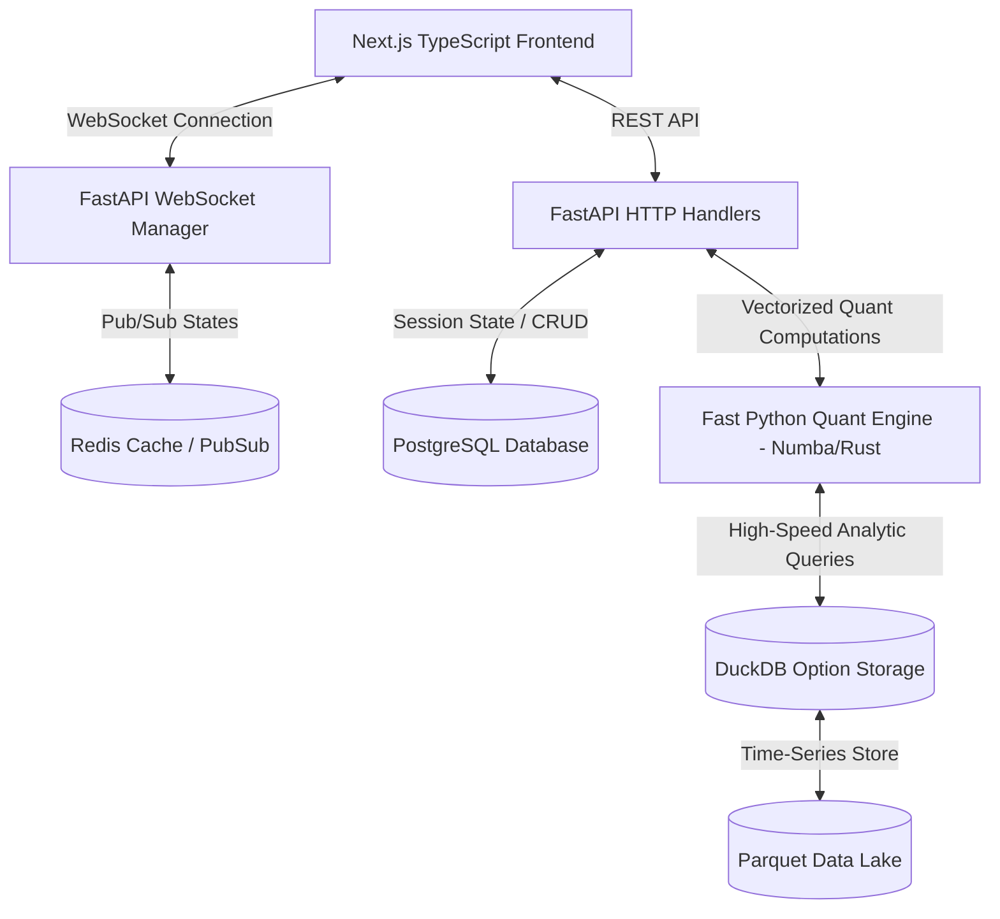
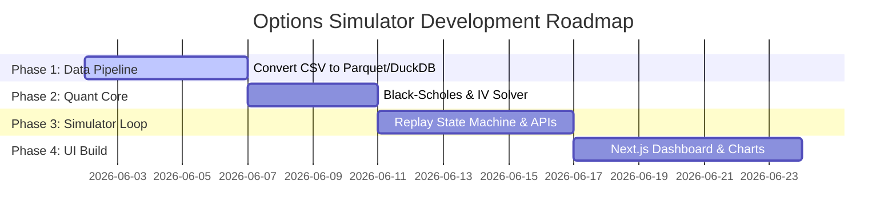

# Production-Grade Options Simulator: Complete Build Plan

This document provides a highly technical, production-ready blueprint for building a commercial-grade Options Simulator modeled after AlgoTest. The design is optimized for performance, scalability, and sub-10ms response times.

---

## 1. PRODUCT ARCHITECTURE & COMMUNICATION FLOW

The platform's engineering architecture relies on asynchronous messaging and highly cached query engines:



### Communication Sequence: Replay Jump (+5m)
1. **Frontend Request:** Frontend sends a WebSocket message or HTTP POST: `{"action": "jump", "seconds": 300, "session_id": "9b1deb4d-3b7d-4bad-9bdd-2b0d7b3dcb6d"}`.
2. **Replay Coordinator:** FastAPI fetches current session state (current timestamp, open positions) from **Redis** (Cache) or **PostgreSQL** (Fallback).
3. **Data Retrieval Engine:** Backend increments the session time by 5 minutes. It concurrently executes two lightweight threads:
   * Thread A: Queries the Spot price for the new timestamp from the Nifty index Parquet directory via **DuckDB**.
   * Thread B: Queries the Option chain prices (Close, Volume, Open Interest) matching the symbols for the given expiry and strike ranges at the target timestamp.
4. **Quant pricing Engine:**
   * Receives Spot, Strikes, DTE, Risk-free Rate, and Option LTPs.
   * Solves for **Implied Volatility (IV)** numerically for all strikes.
   * Calculates option **Greeks** (Delta, Gamma, Theta, Vega) using BSM.
   * Updates Open Positions MTM using the new option prices.
5. **State Broadcast:** Pushes the finalized state frame back to the frontend via WebSockets in JSON format. Total latency target: **<15ms**.

---

## 2. MARKET DATA ARCHITECTURE

Your raw data consists of:
* **Indices (Spot):** `NIFTY 50_minute.csv` with schema `date,open,high,low,close,volume`. Date format: `DD-MM-YYYY HH:MM`.
* **Options:** Daily CSV files named `GFDLNFO_OPTIONS_DDMMYYYY.csv` containing columns `Ticker,Date,Time,Open,High,Low,Close,Volume,Open Interest`.
  * Ticker naming convention: `[SYMBOL][ExpiryDay][ExpiryMonth][ExpiryYear][Strike][OptionType].NFO` (e.g. `BANKNIFTY26MAY2643000PE.NFO`).

### Parquet Data Lake Structure
For sub-second time scrubbing, CSVs must be pre-processed into compressed **Apache Parquet** partitioned files.

```bash
data_lake/
├── spot/
│   └── symbol=NIFTY/
│       └── year=2026/
│           └── spot_nifty_2026.parquet
└── options/
    └── symbol=NIFTY/
        └── expiry=2026-05-26/
            └── date=2026-05-04/
                └── data.parquet
```

#### Parquet File Schemas
##### 1. Spot (spot.parquet):
* `timestamp`: Timestamp (UTC or local microseconds)
* `open`: Float32
* `high`: Float32
* `low`: Float32
* `close`: Float32

##### 2. Options (data.parquet):
* `timestamp`: Timestamp
* `strike`: Int32
* `option_type`: Categorical (CE/PE)
* `open`: Float32
* `high`: Float32
* `low`: Float32
* `close`: Float32
* `volume`: Int32
* `open_interest`: Int32

---

## 3. OPTION CHAIN ENGINE

```python
import numpy as np
import pandas as pd

def generate_option_chain(spot_price: float, strike_interval: int, num_strikes: int = 15) -> dict:
    """
    Algorithm to generate symmetric strikes around At-The-Money (ATM).
    """
    # 1. Detect ATM Strike
    atm_strike = int(round(spot_price / strike_interval) * strike_interval)
    
    # 2. Generate Strike Ladder
    strikes = []
    for i in range(-num_strikes, num_strikes + 1):
        strike = atm_strike + (i * strike_interval)
        strikes.append(strike)
        
    return {
        "atm_strike": atm_strike,
        "strikes": strikes,
        "itm_call_range": [s for s in strikes if s < atm_strike],
        "otm_call_range": [s for s in strikes if s > atm_strike],
        "itm_put_range": [s for s in strikes if s > atm_strike],
        "otm_put_range": [s for s in strikes if s < atm_strike],
    }
```

* **Strike Intervals:** NIFTY: 50 | BANKNIFTY: 100 | FINNIFTY: 50.
* **Underlying Spot Fetch:** Queries target timestamp Spot price, maps it into the calculation above, and queries corresponding option contract rows matching the generated strikes from DuckDB.

---

## 4. EXPIRY ENGINE

### Expiry Detection and Day-to-Expiry (DTE) Calculations

```python
import datetime
from pandas.tseries.holiday import AbstractHolidayCalendar, Holiday

class NSEHolidayCalendar(AbstractHolidayCalendar):
    rules = [
        Holiday('Republic Day', month=1, day=26),
        Holiday('Independence Day', month=8, day=15),
        Holiday('Gandhi Jayanti', month=10, day=2),
        # Add exchange specific holidays dynamically from DB
    ]

def calculate_dte(current_time: datetime.datetime, expiry_date: datetime.date) -> float:
    """
    Computes fractional Years to Expiry (T) for Greeks and Days to Expiry for UI.
    """
    expiry_datetime = datetime.datetime.combine(expiry_date, datetime.time(15, 30, 0))
    time_delta = expiry_datetime - current_time
    
    seconds_remaining = time_delta.total_seconds()
    if seconds_remaining <= 0:
        return 0.0
        
    # Year fraction based on standard trading calendar (252 days) or calendar days (365)
    # Quant systems typically use calendar days for theta but trading days for others. BSM uses 365.
    t_years = seconds_remaining / (365.0 * 24.0 * 3600.0)
    dte_days = max(0, time_delta.days)
    
    return {
        "t_years": t_years,
        "dte_days": dte_days,
        "ui_label": f"{expiry_date.strftime('%d %b').upper()} ({dte_days}d)"
    }
```

---

## 5. OPTION PRICING ENGINE

Because historical option simulators run on static datasets, real historical transaction orders are simulated using the historical 1-minute Close price as the LTP.

```
[Raw CSV Options File] 
        │ (Fast Extraction via polars & DuckDB)
        ▼
[Replay Query] -> SELECT close, volume, open_interest WHERE timestamp = T AND strike = K AND type = CE
        │
        ▼
[Bid/Ask Spread Simulation]
  Spread = Max(TickSize (0.05), close * 0.001)  # 0.1% spread estimation
  Bid = Close - (Spread / 2)
  Ask = Close + (Spread / 2)
```

---

## 6. GREEKS ENGINE (BLACK-SCHOLES-MERTON)

Vectorized calculations compiled with **Numba** for speed.

```python
import scipy.stats as si
from numba import jit

@jit(nopython=True)
def bsm_greeks(S: float, K: float, T: float, r: float, sigma: float, option_type: str = 'CE'):
    """
    Highly optimized math calculations. 
    S=Spot, K=Strike, T=Time to Expiry (Years), r=Interest Rate, sigma=IV
    """
    if T <= 0.0001:
        # Handling Expiry Edge Cases to avoid division by zero
        if option_type == 'CE' or option_type == 'call':
            delta = 1.0 if S >= K else 0.0
            theta = 0.0
        else:
            delta = -1.0 if S <= K else 0.0
            theta = 0.0
        return delta, 0.0, theta, 0.0
        
    d1 = (np.log(S / K) + (r + 0.5 * sigma ** 2) * T) / (sigma * np.sqrt(T))
    d2 = d1 - sigma * np.sqrt(T)
    
    # Cumulative Normal Distribution values
    N_d1 = 0.5 * (1.0 + np.erf(d1 / np.sqrt(2.0)))
    N_d2 = 0.5 * (1.0 + np.erf(d2 / np.sqrt(2.0)))
    n_d1 = np.exp(-0.5 * d1**2) / np.sqrt(2.0 * np.pi)
    
    # Calculate Greeks
    if option_type == 'CE' or option_type == 'call':
        delta = N_d1
        theta = (- (S * n_d1 * sigma) / (2 * np.sqrt(T)) - r * K * np.exp(-r * T) * N_d2) / 365.0
    else:
        delta = N_d1 - 1.0
        theta = (- (S * n_d1 * sigma) / (2 * np.sqrt(T)) + r * K * np.exp(-r * T) * (1.0 - N_d2)) / 365.0
        
    gamma = n_d1 / (S * sigma * np.sqrt(T))
    vega = (S * np.sqrt(T) * n_d1) / 100.0  # Vega per 1% change in IV
    
    return delta, gamma, theta, vega
```

---

## 7. IMPLIED VOLATILITY ENGINE

IV Solver using Newton-Raphson method. If it fails to converge, Bisection method is used as a fallback.

```python
@jit(nopython=True)
def bsm_price(S: float, K: float, T: float, r: float, sigma: float, option_type: str) -> float:
    d1 = (np.log(S / K) + (r + 0.5 * sigma ** 2) * T) / (sigma * np.sqrt(T))
    d2 = d1 - sigma * np.sqrt(T)
    N_d1 = 0.5 * (1.0 + np.erf(d1 / np.sqrt(2.0)))
    N_d2 = 0.5 * (1.0 + np.erf(d2 / np.sqrt(2.0)))
    if option_type == 'CE':
        return S * N_d1 - K * np.exp(-r * T) * N_d2
    else:
        return K * np.exp(-r * T) * (1.0 - N_d2) - S * (1.0 - N_d1)

@jit(nopython=True)
def calculate_iv(market_price: float, S: float, K: float, T: float, r: float, option_type: str) -> float:
    # Handle deep OTM/worthless options
    if market_price <= 0.05:
        return 0.01
        
    sigma = 0.3  # Initial guess
    tol = 1e-5
    max_iter = 100
    
    for i in range(max_iter):
        price = bsm_price(S, K, T, r, sigma, option_type)
        diff = price - market_price
        if abs(diff) < tol:
            return sigma
            
        # Vega calculation
        d1 = (np.log(S / K) + (r + 0.5 * sigma ** 2) * T) / (sigma * np.sqrt(T))
        n_d1 = np.exp(-0.5 * d1**2) / np.sqrt(2.0 * np.pi)
        vega = S * np.sqrt(T) * n_d1
        
        if vega < 1e-4:
            # Fallback to Bisection if vega is too small
            break
        sigma = sigma - diff / vega
        
    # Bisection Fallback
    low_sigma, high_sigma = 0.001, 4.0
    for i in range(50):
        mid_sigma = (low_sigma + high_sigma) / 2.0
        price = bsm_price(S, K, T, r, mid_sigma, option_type)
        if abs(price - market_price) < tol:
            return mid_sigma
        if price > market_price:
            high_sigma = mid_sigma
        else:
            low_sigma = mid_sigma
            
    return mid_sigma
```

---

## 8. POSITION ENGINE

Manages entry prices, execution types, lots, and trades status within a session.

### REST Endpoints (FastAPI)
* `POST /api/v1/simulation/positions/open` (Open new position leg)
* `POST /api/v1/simulation/positions/close` (Close existing leg)
* `GET /api/v1/simulation/positions` (Get all open and active positions)

#### Request Payload Model
```json
{
  "session_id": "9b1deb4d-3b7d-4bad-9bdd-2b0d7b3dcb6d",
  "symbol": "NIFTY",
  "expiry": "2026-05-26",
  "strike": 24000,
  "option_type": "PE",
  "transaction_type": "BUY",
  "qty": 50,
  "entry_price": 177.05,
  "timestamp": "2026-05-06T10:16:00"
}
```

---

## 9. HEDGING ENGINE

Dynamic hedging calculation evaluates strategy components (e.g. Iron Condor vs. Bull Put Spread) and determines how premium risk shifts by adding another option contract or synthetic future.

* **Straddle/Strangle:** Short Call + Short Put. Adding a Long OTM Put/Call shifts the strategy to an **Iron Fly / Iron Condor** reducing risk margins.
* **Synthetic Future:** Long ATM Call + Short ATM Put.
* **Payoff Impact Calculation:** Evaluated instantly by combining option chains and spot ranges.

---

## 10. PAYOFF ENGINE

Generates arrays of projected PnL across underlying index values at expiry.

```python
def generate_payoff_data(positions: list, spot_price: float, num_points: int = 100) -> dict:
    """
    Generates data arrays for Recharts Payoff rendering.
    """
    # Range: Spot +/- 10%
    x_range = np.linspace(spot_price * 0.90, spot_price * 1.10, num_points)
    payoffs = []
    
    max_loss = -float('inf')
    max_profit = float('inf')
    breakevens = []
    
    for x in x_range:
        y_pnl = 0.0
        for pos in positions:
            mult = 1 if pos['transaction_type'] == 'BUY' else -1
            lot_size = pos['qty']
            
            if pos['option_type'] == 'CE':
                intrinsic_val = max(x - pos['strike'], 0.0)
            else:
                intrinsic_val = max(pos['strike'] - x, 0.0)
                
            leg_pnl = (intrinsic_val - pos['entry_price']) * mult * lot_size
            y_pnl += leg_pnl
            
        payoffs.append({"underlying_price": round(x, 2), "pnl": round(y_pnl, 2)})
    
    # Calculate key metrics
    pnl_array = np.array([p['pnl'] for p in payoffs])
    max_loss = round(float(np.min(pnl_array)), 2)
    max_profit = round(float(np.max(pnl_array)), 2)
    
    # Find breakevens where sign changes
    for i in range(len(payoffs) - 1):
        if (payoffs[i]['pnl'] < 0 and payoffs[i+1]['pnl'] >= 0) or (payoffs[i]['pnl'] > 0 and payoffs[i+1]['pnl'] <= 0):
            breakevens.append(payoffs[i]['underlying_price'])
            
    return {
        "graph_data": payoffs,
        "max_loss": max_loss if max_loss < 0 else "Unlimited",
        "max_profit": max_profit if max_profit > 0 else "Unlimited",
        "breakevens": breakevens
    }
```

---

## 11. MARGIN ENGINE

Approximating margins dynamically using Exposure & Risk spread offsets:

```
Naked Sell Position Margin:
  Base Margin = 0.12 * LotSize * StrikePrice 
  Exposure Margin = 0.02 * LotSize * StrikePrice
  Net Margin = Base Margin + Exposure Margin

Hedged Spread Offset Benefit:
  If a Short Leg has a matching Long Protective Leg of the same Expiry:
    If CE: LongStrike > ShortStrike (Spread Margin = Difference * LotSize)
    If PE: LongStrike < ShortStrike (Spread Margin = Difference * LotSize)
    Hedged Margin Required = Spread Margin + Base MarginOffset (15,000 Flat)
```

---

## 12. REPLAY ENGINE

The central backend coordinator running an active Redis loop.

```python
async def handle_time_jump(session_id: str, new_time: datetime.datetime):
    # 1. Fetch Open Positions
    positions = await db.get_active_positions(session_id)
    
    # 2. Get Spot Index price at new time
    spot = await data_lake.get_spot_price("NIFTY", new_time)
    
    # 3. Update Position LTPs from historical options parquet files
    updated_positions = []
    total_mtm = 0.0
    
    for pos in positions:
        # Get contract close price at new_time
        close_price = await data_lake.get_option_price(
            symbol=pos['underlying'], 
            expiry=pos['expiry'], 
            strike=pos['strike'], 
            opt_type=pos['option_type'], 
            time=new_time
        )
        
        # Calculate MTM
        mult = 1 if pos['transaction_type'] == 'BUY' else -1
        pnl = (close_price - pos['entry_price']) * mult * pos['qty']
        total_mtm += pnl
        
        pos['ltp'] = close_price
        pos['mtm'] = pnl
        updated_positions.append(pos)
        
    # 4. Save state frame to Redis cache for sub-second UI updates
    state_frame = {
        "timestamp": new_time.isoformat(),
        "spot": spot,
        "positions": updated_positions,
        "total_mtm": total_mtm
    }
    await redis.set(f"session:{session_id}:state", state_frame)
    return state_frame
```

---

## 13. ALERT ENGINE

Alerts are registered in a PostgreSQL database and loaded into memory on session start:
* **Trigger evaluation:** Each tick evaluation runs in `O(N)` where N is active alerts.
* **Fields Evaluated:** Spot Price, Leg Delta, Total Session MTM, Strategy Delta.
* **Replay Pause Action:** If an alert returns `True`, Backend sends an alert signal to the Frontend and pauses Autoplay immediately.

---

## 14. DASHBOARD ENGINE (FRONTEND React TS)

Built using Next.js, Radix UI, and Recharts.

### Key Components

```
app/
├── components/
│   ├── OptionChainTable.tsx       <-- Dynamic grid optimized for fast pricing updates
│   ├── PositionList.tsx           <-- Active trades and leg manager
│   ├── PayoffChart.tsx            <-- Recharts AreaChart displaying profit/loss bounds
│   └── ReplayControlBar.tsx       <-- Scrubber and speed selectors
```

#### OptionChainTable.tsx Structuring:
Uses **Tailwind CSS** with virtualized tables (`@tanstack/react-virtual`) to allow scrolling through 100 strikes smoothly at 60 FPS during fast replay updates.

---

## 15. API DESIGN

### 1. Retrieve Current Option Chain snapshot
`GET /api/v1/market/chain?underlying=NIFTY&expiry=2026-05-26&time=2026-05-04T09:16:00`
#### Response:
```json
{
  "timestamp": "2026-05-04T09:16:00",
  "spot_price": 24082.65,
  "futures_price": 24100.10,
  "option_chain": [
    {
      "strike": 24000,
      "call": {
        "ltp": 120.50,
        "delta": 0.58,
        "theta": -12.4,
        "gamma": 0.0004,
        "vega": 15.2,
        "iv": 0.142
      },
      "put": {
        "ltp": 45.20,
        "delta": -0.42,
        "theta": -8.7,
        "gamma": 0.0004,
        "vega": 14.8,
        "iv": 0.138
      }
    }
  ]
}
```

---

## 16. PRODUCTION DATABASE SCHEMAS (PostgreSQL)

```sql
CREATE TABLE users (
    id UUID PRIMARY KEY DEFAULT gen_random_uuid(),
    email VARCHAR(255) UNIQUE NOT NULL,
    created_at TIMESTAMP DEFAULT CURRENT_TIMESTAMP
);

CREATE TABLE replay_sessions (
    id UUID PRIMARY KEY DEFAULT gen_random_uuid(),
    user_id UUID REFERENCES users(id) ON DELETE CASCADE,
    underlying VARCHAR(32) NOT NULL,
    session_start_time TIMESTAMP NOT NULL,
    session_current_time TIMESTAMP NOT NULL,
    config JSONB DEFAULT '{}'::jsonb
);

CREATE TABLE session_positions (
    id UUID PRIMARY KEY DEFAULT gen_random_uuid(),
    session_id UUID REFERENCES replay_sessions(id) ON DELETE CASCADE,
    symbol VARCHAR(64) NOT NULL,
    strike NUMERIC(10,2) NOT NULL,
    option_type VARCHAR(2) CHECK (option_type IN ('CE', 'PE')),
    transaction_type VARCHAR(4) CHECK (transaction_type IN ('BUY', 'SELL')),
    qty INT NOT NULL,
    entry_price NUMERIC(10,2) NOT NULL,
    entry_timestamp TIMESTAMP NOT NULL,
    exit_price NUMERIC(10,2) DEFAULT NULL,
    exit_timestamp TIMESTAMP DEFAULT NULL,
    status VARCHAR(16) DEFAULT 'OPEN'
);
```

---

## 17. DEVELOPMENT ROADMAP

### Folder Structure Setup
```
options-simulator/
├── backend/
│   ├── app/
│   │   ├── main.py
│   │   ├── api/
│   │   ├── quant/
│   │   │   ├── pricing.py
│   │   │   └── greeks.py
│   │   └── data/
│   │       └── reader.py
│   └── requirements.txt
└── frontend/
    ├── src/
    │   ├── app/
    │   │   ├── page.tsx
    │   │   └── layout.tsx
    │   ├── components/
    │   └── hooks/
    └── package.json
```

### Phase-wise Execution Plan



* **Phase 1: Market Data Optimization (Days 1-5):** Build an ETL script inside `backend/app/data/` using **Polars** to read raw day-wise option files, split tickers into fields (`strike`, `option_type`), and write highly compressed partitioned Parquet files indexed by Date and Expiry.
* **Phase 2: Math/Quant Library (Days 6-9):** Implement the vectorized BSM Greeks and Newton-Raphson IV modules using Numba. Verify accuracy using standard pricing benchmarks.
* **Phase 3: Replay State Loop (Days 10-15):** Setup PostgreSQL schemas, implement session state controllers, and write standard session action APIs. Add mock bid/ask slippage logic.
* **Phase 4: Dashboard Integration (Days 16-22):** Code the interactive Next.js Dashboard. Bind real-time data onto TanStack tables and Recharts payoff lines. Add speed/autoplays.
